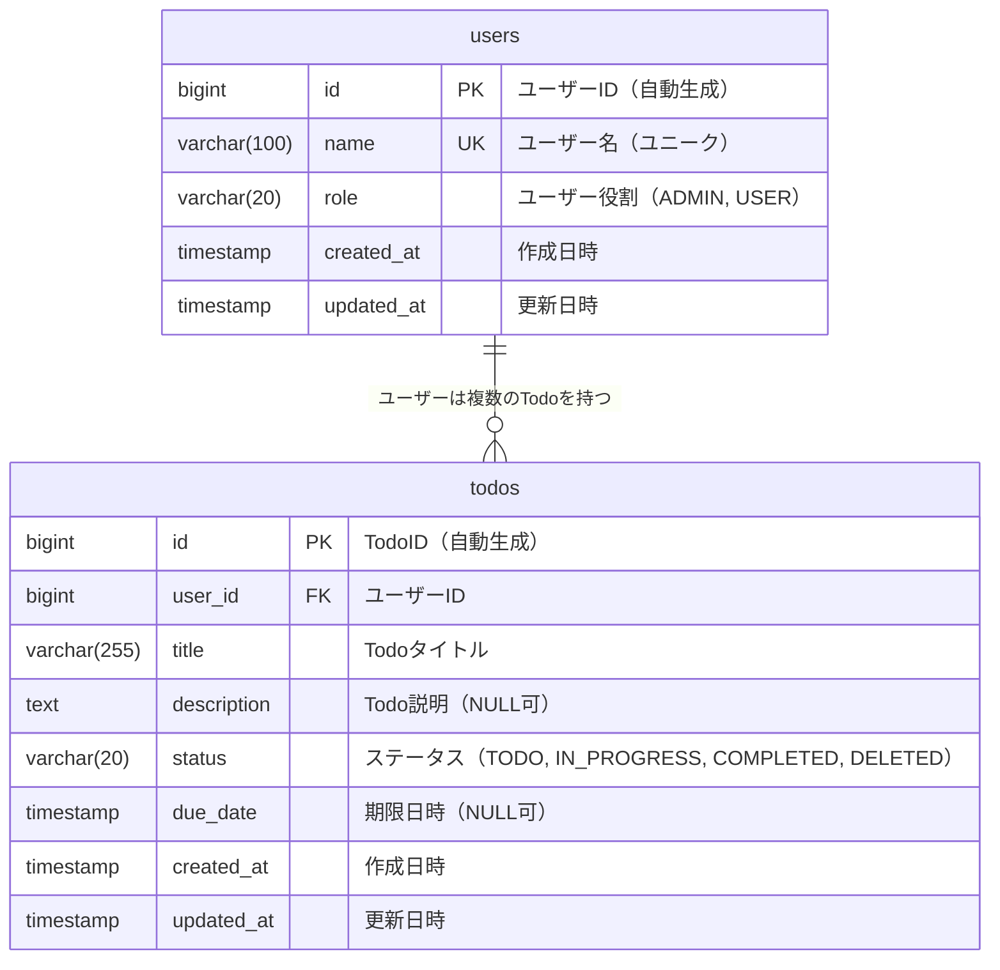

# Todo App データベース設計書

## ER図



## テーブル定義

### users テーブル

| カラム名 | データ型 | 制約 | 説明 |
|----------|----------|------|------|
| id | BIGSERIAL | PRIMARY KEY | ユーザーID（自動生成） |
| name | VARCHAR(100) | NOT NULL, UNIQUE | ユーザー名 |
| role | VARCHAR(20) | NOT NULL, DEFAULT 'USER' | ユーザー役割 |
| created_at | TIMESTAMP | NOT NULL, DEFAULT CURRENT_TIMESTAMP | 作成日時 |
| updated_at | TIMESTAMP | NOT NULL, DEFAULT CURRENT_TIMESTAMP | 更新日時 |

**役割（role）の値**:
- `ADMIN`: 管理者
- `USER`: 一般ユーザー

### todos テーブル

| カラム名 | データ型 | 制約 | 説明 |
|----------|----------|------|------|
| id | BIGSERIAL | PRIMARY KEY | TodoID（自動生成） |
| user_id | BIGINT | NOT NULL, FOREIGN KEY | ユーザーID |
| title | VARCHAR(255) | NOT NULL | Todoタイトル |
| description | TEXT | NULL | Todo説明 |
| status | VARCHAR(20) | NOT NULL, DEFAULT 'TODO' | ステータス |
| due_date | TIMESTAMP | NULL | 期限日時 |
| created_at | TIMESTAMP | NOT NULL, DEFAULT CURRENT_TIMESTAMP | 作成日時 |
| updated_at | TIMESTAMP | NOT NULL, DEFAULT CURRENT_TIMESTAMP | 更新日時 |

**ステータス（status）の値**:
- `TODO`: 未完了
- `IN_PROGRESS`: 進行中  
- `COMPLETED`: 完了
- `DELETED`: 削除（論理削除）

### 制約

#### 外部キー制約
- `todos.user_id` → `users.id`
  - `ON DELETE CASCADE`: ユーザー削除時に関連するTodoも削除
  - `ON UPDATE CASCADE`: ユーザーID更新時に関連するTodo側も更新

#### インデックス
- `users.name`: ユニークインデックス（ログイン用）
- `todos.user_id`: 外部キーインデックス（検索最適化）
- `todos.status`: 条件検索用インデックス
- `todos.created_at`: 作成日時順ソート用インデックス
- `todos.due_date`: 期限検索用インデックス（NULL値含む）

#### チェック制約
- `users.role`: `role IN ('ADMIN', 'USER')`
- `todos.status`: `status IN ('TODO', 'IN_PROGRESS', 'COMPLETED', 'DELETED')`
- `todos.title`: `LENGTH(TRIM(title)) > 0`（空文字列禁止）

## パフォーマンス設計

### 想定クエリパターン

1. **ユーザー別Todo一覧**
   ```sql
   SELECT * FROM todos 
   WHERE user_id = ? AND status != 'DELETED' 
   ORDER BY created_at DESC;
   ```

2. **ステータス別Todo検索**
   ```sql
   SELECT * FROM todos 
   WHERE user_id = ? AND status = ? 
   ORDER BY created_at DESC;
   ```

3. **期限切れTodo検索**
   ```sql
   SELECT * FROM todos 
   WHERE user_id = ? AND due_date < CURRENT_TIMESTAMP AND status != 'COMPLETED'
   ORDER BY due_date ASC;
   ```

### 複合インデックス
- `(user_id, status, created_at)`: ユーザー別ステータス検索 + ソート
- `(user_id, due_date)`: ユーザー別期限検索

## 設計方針

### DDD観点
- **集約境界**: `User`と`Todo`は独立した集約
- **整合性**: ユーザー削除時のTodo削除はCASCADEで対応
- **値オブジェクト**: `title`、`description`等はアプリケーション層で値オブジェクト化

### CQRS観点
- **Command側**: 正規化されたテーブル構造でデータ整合性重視
- **Query側**: 必要に応じてVIEWやマテリアライズドVIEWで最適化
- **読み取り最適化**: 複合インデックスで一般的な検索パターンをカバー

### 将来の拡張性
- **Todo詳細情報**: 必要に応じて`todo_details`テーブルを追加
- **タグ機能**: `tags`テーブルと`todo_tags`中間テーブル
- **コメント機能**: `todo_comments`テーブル
- **添付ファイル**: `todo_attachments`テーブル

## Liquibase移行戦略

### 初期セットアップ
1. `V001_create_users_table.sql`: usersテーブル作成
2. `V002_create_todos_table.sql`: todosテーブル作成
3. `V003_create_indexes.sql`: インデックス作成
4. `V004_insert_sample_data.sql`: サンプルデータ投入

### バージョニング
- 形式: `VXXX_description.sql`
- メジャーバージョン: スキーマ変更
- マイナーバージョン: データ変更、インデックス追加
